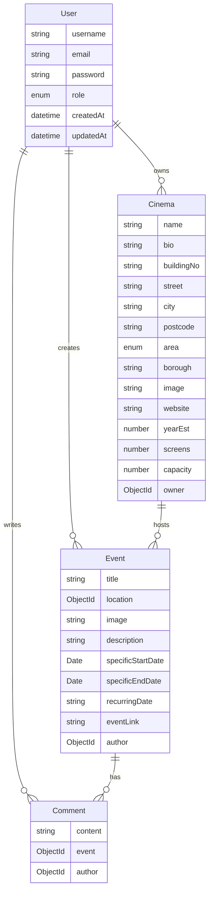

# Kino Connect Backend API

## Overview

Kino Connect is a platform that connects independent cinemas with film enthusiasts, allowing venues to showcase their unique events and engage with their community. This backend API, built with TypeScript, Express, and MongoDB, provides the infrastructure for cinema management, event hosting, and community engagement.

Built over the course of one week as a solo project, it serves as the backend for [Kino Connect](https://kino-connect.netlify.app).

## Technologies Used

- TypeScript
- Node.js & Express.js
- MongoDB & Mongoose
- JWT Authentication
- Express Mongo Sanitize
- CORS enabled
- Bcrypt for password hashing
- Validator for input validation

## Quick Start

### Prerequisites

- Node.js (v14 or higher)
- MongoDB installed locally or a MongoDB Atlas account
- Git

### Installation

```bash
# Clone the repository
git clone <your-repo-url>
cd kino-backend

# Install dependencies
npm install

# Set up environment variables
# Create a .env file in the root directory with:
PORT=4000
MONGO_DB_URL=your_mongodb_connection_string
SECRET=your_jwt_secret

# Run the development server
npm run dev
```

### Database Seeding

The project includes a seed file to populate the database with initial data:

```bash
# Run the seed file
npm run seed
```

This will create:

- An admin user (KinoConnect)
- A sample cinema (The Rio Cinema)
- A sample event (Pink Palace)
- A sample comment

## Data Models

### Entity Relationship Diagram

The following diagram shows the relationships between the core data models:



### User Model

The user model implements role-based access control and secure password handling:

```typescript
interface IUser {
  username: string;
  email: string;
  password: string;
  role: "Cinema" | "Film Fanatic";
}

const userSchema: Schema<IUser> = new Schema(
  {
    username: { type: String, required: true, unique: true },
    email: {
      type: String,
      required: true,
      unique: true,
      validate: (email: string) => validator.isEmail(email),
    },
    password: {
      type: String,
      required: true,
      hide: true,
      validate: (password: string) =>
        validator.isStrongPassword(password, {
          minLength: 8,
          minLowercase: 1,
          minUppercase: 1,
          minNumbers: 1,
          minSymbols: 1,
        }),
    },
    role: { type: String, required: true, enum: ["Cinema", "Film Fanatic"] },
  },
  { timestamps: true }
);

// Password hashing middleware
userSchema.pre("save", function hashPassword(next) {
  this.password = bcrypt.hashSync(this.password, bcrypt.genSaltSync());
  next();
});

// Helper functions for password validation
export function checkPassword(password: string, passwordConfirmation: string) {
  return password === passwordConfirmation;
}

export function validatePassword(
  plainTextPassword: string,
  hashedPasswordfromDB: string
) {
  return bcrypt.compareSync(plainTextPassword, hashedPasswordfromDB);
}
```

Key features of the User model:

- **Role-Based Access**: Two distinct user types:
  - `Cinema`: Can create and manage cinema profiles and events
  - `Film Fanatic`: Can interact with events and post comments
- **Security Features**:
  - Password hashing with bcrypt
  - Strong password validation
  - Hidden password field in responses
- **Email Validation**: Ensures valid email format
- **Unique Constraints**: Prevents duplicate usernames and emails
- **Timestamp Tracking**: Records creation and update times

### Cinema Model

The cinema model includes structured address fields for better organization and querying:

```typescript
interface ICinema {
  name: string;
  bio: string;
  address: string;
  buildingNo: string;
  street: string;
  city: "London";
  postcode: string;
  area: "North" | "East" | "South" | "West" | "Central";
  borough: string;
  image: string;
  website: string;
  yearEst: number;
  screens: number;
  capacity: number;
  owner: Types.ObjectId;
}
```

### Event Model

```typescript
interface IEvent {
  title: string;
  location: Types.ObjectId;
  image: string;
  description: string;
  specificStartDate?: Date;
  specificEndDate?: Date;
  recurringDate?: string;
  eventLink: string;
  author: Types.ObjectId;
}
```

### Comment Model

```typescript
interface IComment {
  content: string;
  event: Types.ObjectId;
  author: Types.ObjectId;
}
```

## API Documentation

### Authentication Endpoints

#### Sign Up

```http
POST /api/signup
```

```json
// Request Body
{
  "username": "CinemaName",
  "email": "cinema@example.com",
  "password": "StrongPass1!",
  "passwordConfirmation": "StrongPass1!",
  "role": "Cinema"
}

// Response 201
{
  "username": "CinemaName",
  "email": "cinema@example.com",
  "role": "Cinema",
  "_id": "..."
}
```

#### Login

```http
POST /api/login
```

```json
// Request Body
{
  "email": "cinema@example.com",
  "password": "StrongPass1!"
}

// Response 200
{
  "message": "Login successful. Hi CinemaName, welcome back to Kino Connect.",
  "token": "jwt_token_here"
}
```

### Cinema Endpoints

#### Get All Cinemas

```http
GET /api/cinemas
```

#### Create Cinema (requires Cinema role)

```http
POST /api/cinemas
```

```json
// Request Body
{
  "name": "The Rio Cinema",
  "bio": "Historic art deco cinema...",
  "buildingNo": "107",
  "street": "Kingsland High Street",
  "city": "London",
  "postcode": "E8 2PB",
  "area": "East",
  "borough": "Hackney",
  "image": "image_url",
  "website": "cinema_website",
  "yearEst": 1909,
  "screens": 2,
  "capacity": 430
}
```

### Event Endpoints

#### Get Cinema Events

```http
GET /api/cinemas/:cinemaId/events
```

#### Create Event

```http
POST /api/cinemas/:cinemaId/events
```

```json
// Request Body
{
  "title": "Pink Palace",
  "description": "Weekly queer film night",
  "image": "event_image_url",
  "recurringDate": "Weekly, every Thursday",
  "eventLink": "booking_link"
}
```

### Comment Endpoints

#### Get Event Comments

```http
GET /api/events/:eventId/comments
```

#### Post Comment

```http
POST /api/events/:eventId/comments
```

```json
// Request Body
{
  "content": "What time does this start?"
}
```

## Middleware Architecture

### Account Status Middleware

Handles role-based access control and content ownership verification:

```typescript
import { Request, Response, NextFunction } from "express";
import User from "../models/user";
import Cinema from "../models/cinema";
import Event from "../models/events";
import Comment from "../models/comments";

// Verify user has Cinema role
export const cinemaUserCheck = (
  req: Request,
  res: Response,
  next: NextFunction
) => {
  if (req.currentUser.role !== "Cinema") {
    return res.status(403).json({
      message:
        "Access denied. Only cinema account holders can post a new Cinema to Kino Connection.",
    });
  }
  next();
};

// Verify event ownership or host status
export const eventOwnerOrHostCheck = async (
  req: Request,
  res: Response,
  next: NextFunction
) => {
  const hostCinemaId = req.params.cinemaId;
  const hostCinema = await Cinema.findById(hostCinemaId);
  const hostCinemaOwner = hostCinema?.owner._id;
  const targetEventId = req.params.eventId;
  const targetEvent = await Event.findById(targetEventId);

  if (!targetEvent) {
    return res.status(404).json({ message: "Event not found." });
  }

  const targetEventAuthor = targetEvent?.author._id;
  if (
    req.currentUser._id.equals(hostCinemaOwner) ||
    req.currentUser._id.equals(targetEventAuthor)
  ) {
    next();
  } else {
    return res.status(403).json({
      message:
        "Access denied. Only an event author or host can delete the content.",
    });
  }
};

// Verify comment permissions
export const commentPermission = async (
  req: Request,
  res: Response,
  next: NextFunction
) => {
  const associatedEventId = req.params.eventId;
  const associatedEvent = await Event.findById(associatedEventId);
  const associatedEventAuthor = associatedEvent?.author._id;
  const targetCommentId = req.params.commentId;
  const targetComment = await Comment.findById(targetCommentId);

  if (!targetComment) {
    return res.status(404).json({ message: "Comment not found." });
  }

  const targetCommentAuthor = targetComment?.author._id;
  if (
    req.currentUser._id.equals(associatedEventAuthor) ||
    req.currentUser._id.equals(targetCommentAuthor)
  ) {
    next();
  } else {
    return res.status(403).json({
      message:
        "Access denied. Only an event author or a comment author can remove the content.",
    });
  }
};
```

### Authentication Middleware (secureRoute)

```typescript
export default function secureRoute(
  req: Request,
  res: Response,
  next: NextFunction
) {
  const rawToken = req.headers.authorization;

  if (!rawToken) {
    return res
      .status(401)
      .json({ message: "Unauthorized. No Auth header found" });
  }

  const token = rawToken.replace("Bearer ", "");
  jwt.verify(token, process.env.SECRET as string, async (error, payload) => {
    if (error || !payload) {
      return res.status(401).json({ message: "Unauthorized. Invalid JWT." });
    }

    const jwtPayload = payload as JWTPayload;
    const user = await User.findById(jwtPayload.userId);
    if (!user) {
      return res.status(401).json({ message: "User not found. Invalid JWT!" });
    }
    req.currentUser = user;
    next();
  });
}
```

### Middleware Chain Flow

1. **Request Flow**:

   - First passes through `secureRoute` for authentication
   - Then through role/permission checks (cinemaUserCheck, eventOwnerOrHostCheck, or commentPermission)
   - Finally reaches the controller if all checks pass

2. **Permission Hierarchy**:

   - Cinema Creation: Limited to users with "Cinema" role
   - Event Management: Limited to cinema owners and event creators
   - Comment Management: Limited to comment authors and event owners

3. **Error Handling**:
   - Authentication Errors (401): Invalid or missing JWT
   - Authorization Errors (403): Invalid permissions
   - Not Found Errors (404): Resources don't exist
   - Server Errors (500): Database or system errors

## Error Handling

The API includes comprehensive error handling for:

- Validation errors (mongoose-unique-validator)
- Authentication errors (JWT verification)
- Authorization errors (role-based access)
- Database errors
- Input sanitization (express-mongo-sanitize)

## Development Decisions

### Address Structure

The cinema address is broken down into specific fields to enable:

- Area-based searching and filtering
- Borough-specific queries
- Structured display formatting
- Geographic organization (North/South/East/West/Central)

### Event Flexibility

Events can be either:

- One-time events (specificStartDate/specificEndDate)
- Recurring events (recurringDate as string)
  This allows cinemas to manage both special screenings and regular programs.

## Frontend Integration

The backend is designed to work with the [Kino Frontend](https://github.com/milochambers96/kino-frontend), which is deployed at [https://kino-connect.netlify.app](https://kino-connect.netlify.app).

## Future Features

- Automated testing suite
- Geolocation services
- Event categories and tags
- Advanced search and filtering
- Analytics for cinema owners
- Event attendance tracking
- Social sharing integration
- Postcode validation and formatting
- Automated address verification
- Area-based search radius functionality
